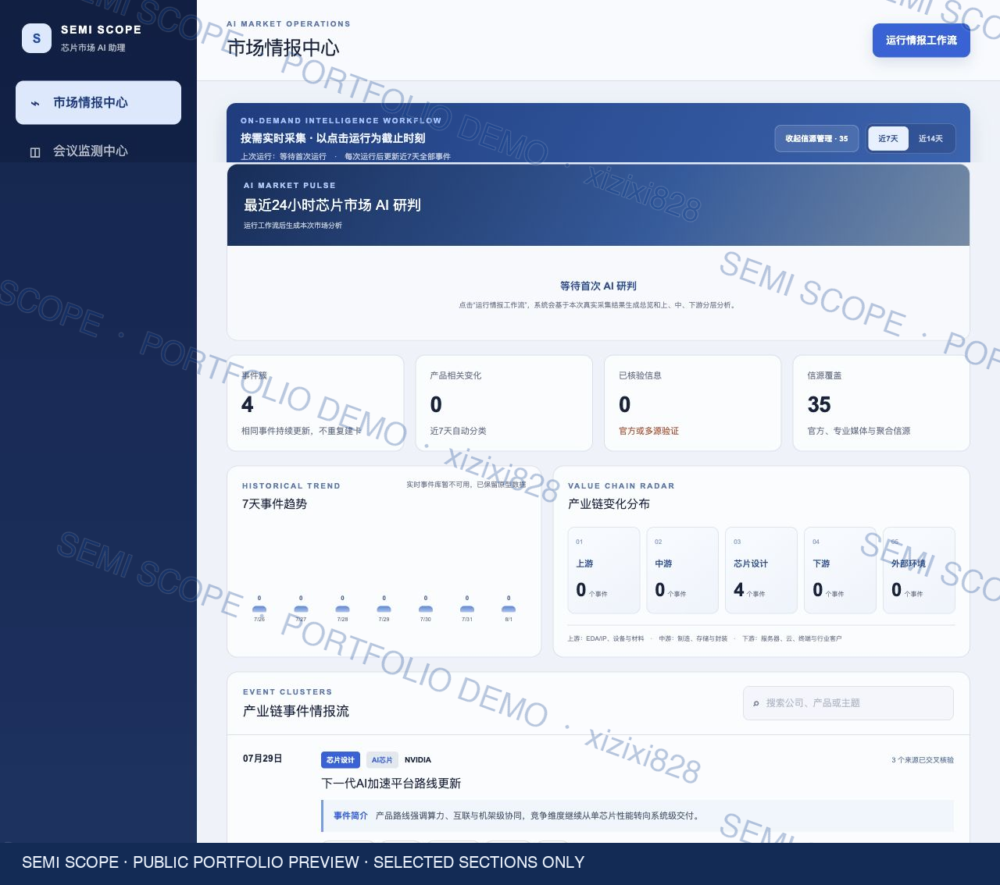
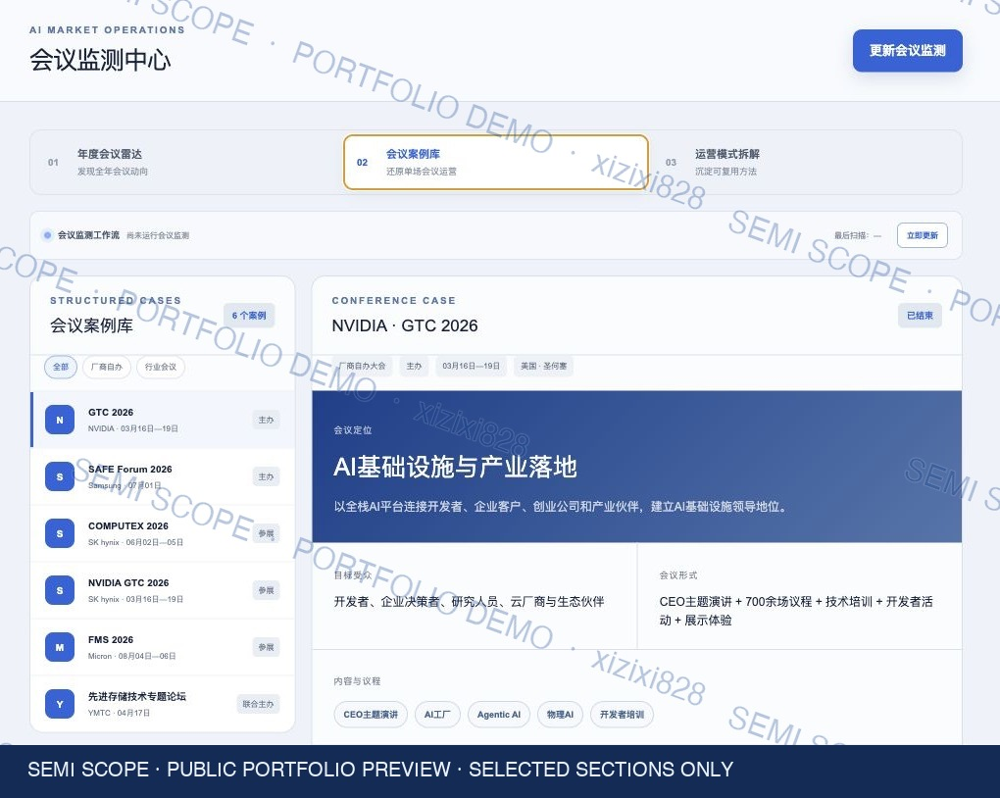
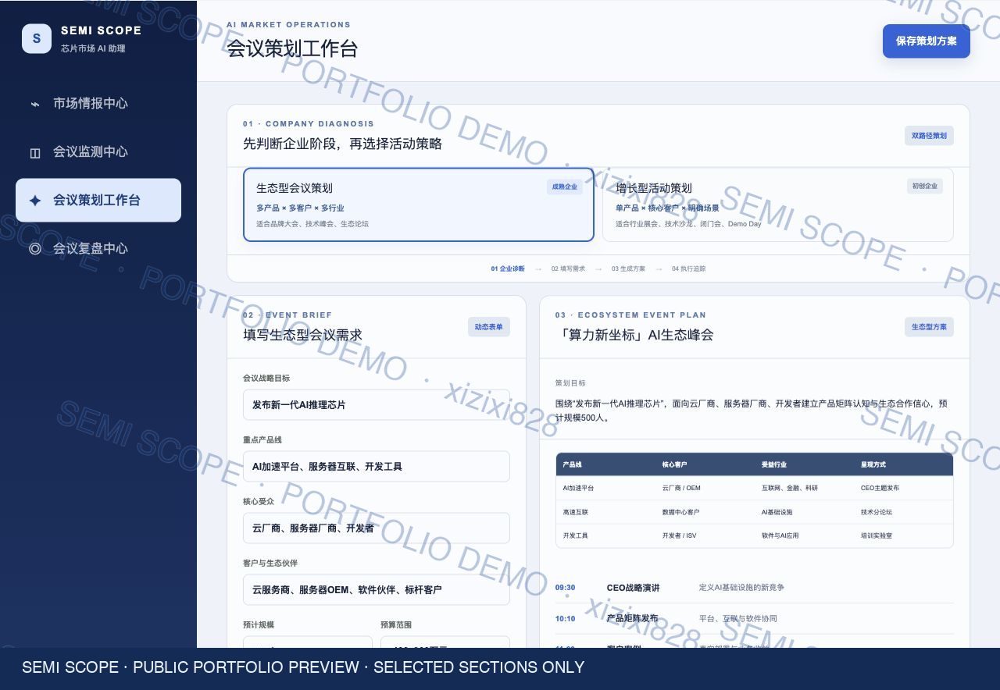
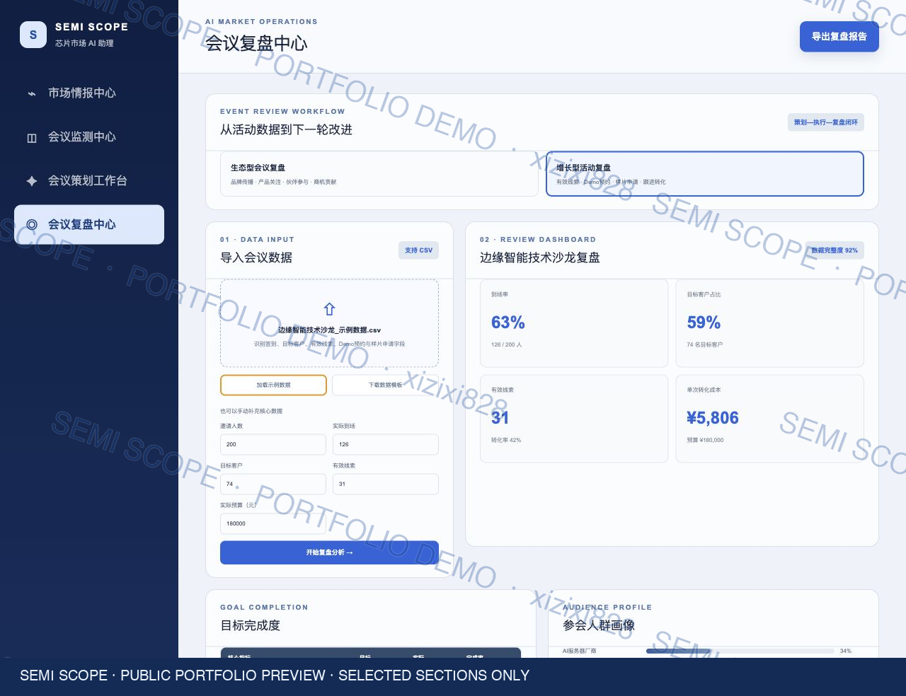

# SEMI SCOPE｜芯片市场 AI 助理

> 面向芯片行业市场团队的市场情报、会议监测、活动策划与数据复盘一体化 AI 工作台。

[在线只读演示](https://semi-scope-ai.xizixi828.chatgpt.site/share/latest)

## 项目背景

在了解市场团队的日常工作后，我注意到四类具有代表性的低效环节：行业资讯分散在不同平台，市场人员需要反复收集和整理；竞品会议和行业活动缺乏统一沉淀方式；活动策划较依赖个人经验；会后数据往往停留在统计层面，难以真正反哺下一轮运营。

因此，我选取信息更新快、产业链复杂、产品和会议动作密集的芯片行业作为验证场景，设计并实现了 SEMI SCOPE 芯片市场 AI 助理。

这个项目的目标不是让 AI 替代市场判断，而是减少重复整理，让市场人员把更多时间用于分析、策划和决策。

## 目标用户

- 芯片企业市场专员、市场运营和品牌人员
- 需要追踪产业链与竞争动态的行业研究人员
- 负责大会、展会、技术沙龙和客户活动的会议运营人员
- 需要通过活动数据评估线索质量和后续转化的市场团队

## 产品架构

### 1. 市场情报中心



- 聚合国内外厂商、产业媒体及行业公开信源
- 支持新增、删除和验证 RSS 或公开资讯列表页
- 按上游材料设备、中游制造封测、芯片设计和下游应用进行分类
- 对同一事件进行去重，后续报道更新原事件卡片
- 基于运行前 24 小时的资讯形成“市场总览—产业链分层—事件证据”结构
- 支持近 7 天和近 14 天趋势查看，并保留原始来源用于核验

### 2. 会议监测中心



- 聚焦厂商自办大会和重要行业会议两类市场动作
- 通过年度会议雷达追踪会议时间、厂商、类型与状态
- 将会议内容拆解为具体产品与功能、高管演讲重点、受益行业和传播动作
- 把典型案例进一步沉淀为可复用的会议运营模式与传播打法

### 3. 会议策划工作台



- 根据企业发展阶段区分两类会议策划路径
- 成熟企业侧重旗舰大会、生态论坛、产品矩阵与品牌叙事
- 初创企业侧重展会、技术沙龙、闭门交流、Demo 和目标客户转化
- 根据活动目标、核心受众、产品、预算和周期生成结构化策划思路

### 4. 会议复盘中心



- 支持手动录入或 CSV 数据导入
- 统一查看报名、到场、目标客户、有效线索、成本等指标
- 针对不同企业阶段设置差异化复盘指标
- 通过转化漏斗识别关键流失环节
- 输出与指标对应的优化结论和后续行动清单

## 工作闭环

```text
公开信息采集
      ↓
去重、分类与来源核验
      ↓
产业链市场研判
      ↓
竞品会议与运营模式沉淀
      ↓
差异化会议策划
      ↓
数据复盘与行动建议
      ↓
反哺下一轮市场策划
```

## 我的工作

本项目为个人独立完成的 AI 产品原型，我主要负责：

- 观察市场团队工作场景并定义核心问题
- 梳理目标用户、使用路径和四模块产品架构
- 设计信源字段、产业链分类、会议案例结构与复盘指标
- 完成交互逻辑、页面信息层级和多轮界面迭代
- 借助 AI 编程与大模型能力实现可交互网页原型
- 设计管理员运行、结果核验和只读快照发布机制
- 制作项目 PPT、面试讲解材料和公开演示版本

## 项目价值

- 将抽象的“AI 提升市场效率”落到具体工作流程
- 把分散资讯转化为可追溯的产业链市场结构
- 将一次性的会议观察沉淀为可复用运营方法
- 根据企业发展阶段设计不同的会议与增长目标
- 让会后数据从结果展示进一步转化为下一轮行动

## 项目阶段与边界

当前版本是用于验证需求、流程和交互逻辑的个人可运行原型，并非企业正式生产系统。

公开页面采用只读快照方式：管理员运行工作流并核验结果后发布最新版本，访客可以浏览完整产品，但不能修改信源、调用模型、上传数据或进入管理后台。

如进一步用于企业场景，还需要接入内部 CRM、活动报名工具、企业权限体系和更完整的人工审核流程。

## 后续规划

- 增强更多非标准资讯页面的解析能力和失败监控
- 补充会议官方资料的自动更新与人工核验流程
- 接入 CRM 和活动报名系统，自动回流转化数据
- 邀请真实市场从业者参与测试，验证时间节省和决策质量

## 说明

本仓库当前用于展示产品思路、市场工作流程和交互原型。公开内容不包含 API Key、管理后台凭证、私人数据或未经清理的内部配置。

## 使用说明

本项目为个人求职作品集，仅用于展示产品设计、市场运营与 AI 应用能力。未经作者许可，请勿复制、修改或重新发布本项目的界面、产品结构及相关材料。页面中的公开行业信息版权归原始来源所有。

          
                                                                                                             

                                                                                                                
